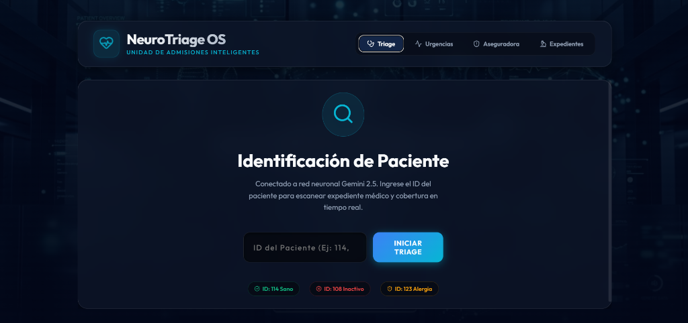
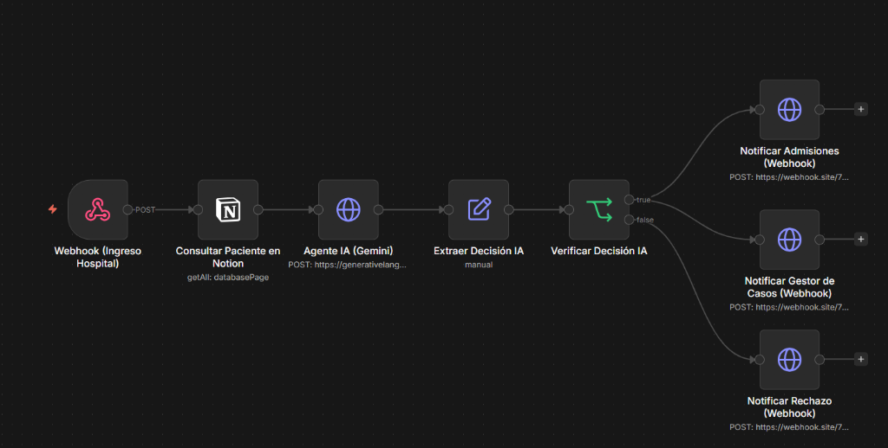
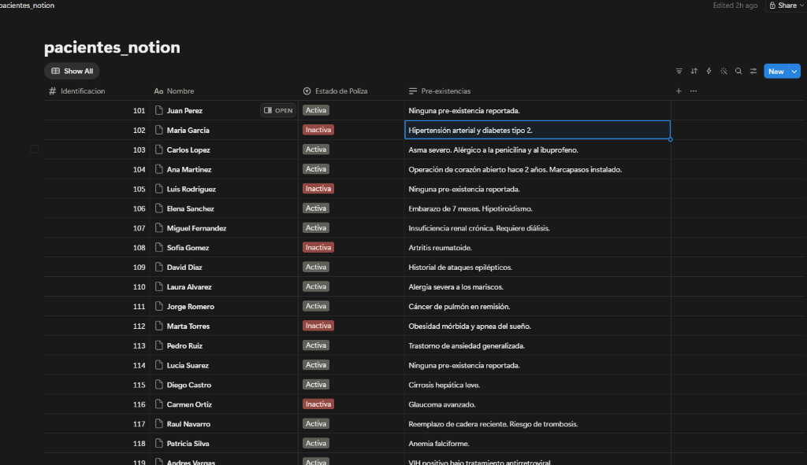

# 🏥 NeuroTriage OS - Sistema de Alerta Temprana de Ingresos a Emergencias




🔗 **[Enlace Público del Agente Funcional (Vercel)](https://hack-i-athon-reto-4.vercel.app/)**

## 🎯 Descripción del Reto
Un webhook que se activa cuando un asegurado ingresa a la emergencia del hospital. Un agente revisa instantáneamente la validez de la póliza, el historial de pre-existencias y envía una notificación al departamento de admisiones del hospital y al gestor de casos del seguro simultáneamente.

## 🏗️ Arquitectura y Tecnologías
Este proyecto se compone de dos partes principales que trabajan en perfecta sincronía:



1. **El Cerebro Lógico (Backend Automation):** Construido en **n8n**. Un flujo de trabajo que recibe un Webhook con el ID del paciente, consulta la base de datos médica en **Notion**, y envía los datos a **Google Gemini 2.5 Flash**. La IA evalúa la póliza y el riesgo clínico en tiempo real, devolviendo un JSON estructurado que n8n enruta a las terminales correspondientes.
2. **El Portal Hospitalario (Frontend):** Construido en **React + Vite** con un diseño *Glassmorphism* ultra-moderno. Actúa como el punto de recepción del hospital donde se ingresa el ID, y simulador de terminales de Webhook para visualizar las decisiones de la IA al instante.

### Base de Datos de Pacientes (Mock EMR)


### Stack Tecnológico:
- **n8n:** Orquestación de flujos y Webhooks.
- **Notion API:** Base de datos de pacientes (Mock EMR).
- **Google Gemini API (2.5 Flash):** Agente experto en Triage Médico y Seguros.
- **React (Vite) + Vanilla CSS:** Interfaz de usuario "NeuroTriage OS".
- **Vercel:** Despliegue continuo (CI/CD).

---

## 🧪 Cómo realizar las pruebas en Vercel (Producción)
Puedes probar el sistema directamente sin instalar nada entrando a nuestro enlace público:
👉 **https://hack-i-athon-reto-4.vercel.app/**

Para evaluar las capacidades de la IA, dirígete a la pestaña **"Triage"** e ingresa uno de los siguientes IDs de prueba (puedes ver la base completa en la pestaña *Expedientes*):

*   🟢 **ID `114` (Caso Ideal):** El paciente tiene póliza activa y sin pre-existencias. El sistema aprobará el ingreso y notificará a urgencias.
*   🔴 **ID `108` (Rechazo Automático):** La póliza está inactiva y tiene historial de artritis. La IA detectará el fraude/falta de cobertura y denegará el ingreso.
*   ⚠️ **ID `123` (Alerta Médica Crítica):** La póliza está activa, **PERO** el paciente tiene alergia a la anestesia general. La IA aprobará el ingreso por el seguro, pero levantará una alerta crítica para los médicos de quirófano.

---

## 💻 Cómo ejecutarlo en Local (Desarrollo)

Si deseas correr el portal interactivo en tu propia computadora:

### Prerrequisitos
- Node.js instalado en tu sistema.
- Git.

### Instalación
1. Clona este repositorio:
   ```bash
   git clone https://github.com/DiegoSteven/hackIAthon_Reto_4-.git
   ```
2. Navega a la carpeta del dashboard React:
   ```bash
   cd hackIAthon_Reto_4-/hospital-dashboard
   ```
3. Instala las dependencias:
   ```bash
   npm install
   ```
4. Ejecuta el servidor de desarrollo:
   ```bash
   npm run dev
   ```
5. Abre `http://localhost:5173` en tu navegador.

### Archivos de n8n
Dentro de la raíz del proyecto se incluye el archivo `workflow_emergencia.json`. Puedes importarlo directamente en tu instancia de n8n, agregar tus propias credenciales de Notion y tu Google Gemini API Key, y el flujo estará 100% operativo.
